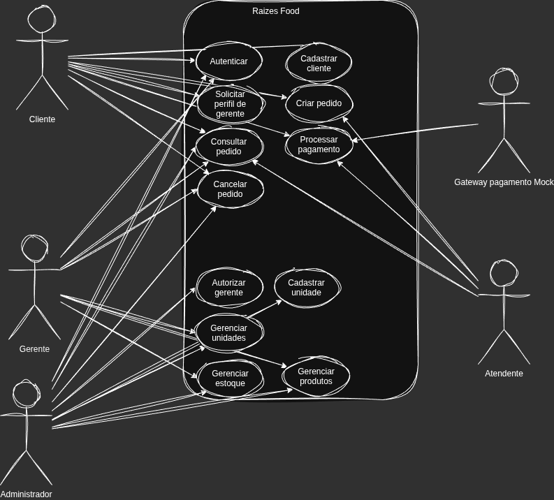

# Casos de Uso

Este documento apresenta os principais casos de uso do Raízes Food e os
atores que interagem com o sistema durante as operações previstas para o MVP.

O objetivo do diagrama é mostrar de forma simples quem utiliza cada
funcionalidade, sem representar os processos internos executados
automaticamente pelo sistema.

## Atores

### Cliente

Usuário comum do sistema. Pode criar sua conta, realizar autenticação,
fazer e acompanhar pedidos e solicitar a alteração do seu perfil para Gerente.

### Gerente

Usuário responsável pela administração das unidades às quais foi associado.
Pode gerenciar informações da unidade, produtos e estoque, além de consultar
e cancelar pedidos dentro das permissões definidas para seu perfil.

### Administrador

Responsável pela administração geral da rede Raízes Food. Possui acesso às
unidades da rede e é responsável pelo cadastro de novas unidades e pela
autorização das solicitações de perfil de Gerente.

### Atendente

Ator utilizado nas operações realizadas no balcão ou totem. Não possui
perfil de usuário autenticável e participa somente das operações relacionadas
ao atendimento de pedidos.

### Gateway de Pagamento Mock

Representa o serviço de pagamento utilizado no MVP. A integração é simulada
e retorna o resultado da tentativa de pagamento como aprovado ou recusado.

---

## Funcionalidades representadas

### Acesso e usuários

**Autenticar usuário**  
Permite que Cliente, Gerente e Administrador acessem o sistema utilizando
suas credenciais.

**Cadastrar cliente**  
Permite a criação de uma nova conta, que inicialmente recebe o perfil
de Cliente.

**Solicitar perfil de Gerente**  
Permite que um Cliente autenticado solicite a alteração do seu perfil
para Gerente.

**Autorizar Gerente**  
Permite ao Administrador aprovar ou rejeitar uma solicitação de perfil
de Gerente e definir as unidades pelas quais o novo Gerente será responsável.

### Administração

**Cadastrar unidade**  
Permite ao Administrador cadastrar uma nova unidade da rede.

**Gerenciar unidades**  
Permite ao Administrador e ao Gerente consultar e alterar as unidades
que estão dentro de suas respectivas permissões.

**Gerenciar produtos**  
Permite ao Administrador e aos Gerentes administrar os produtos que fazem
parte do cardápio da rede.

**Gerenciar estoque**  
Permite consultar, ajustar e registrar entradas no estoque. O Gerente atua
somente nas unidades sob sua responsabilidade, enquanto o Administrador
pode atuar em qualquer unidade.

### Pedidos

**Criar pedido**  
Permite ao Cliente ou ao Atendente criar um pedido para uma unidade,
informando os produtos e suas respectivas quantidades.

**Consultar pedido**  
Permite consultar informações de um pedido. Para usuários autenticados,
a consulta respeita as permissões de cada perfil. Em operações de balcão
ou totem, o Atendente consulta um pedido específico pelo seu identificador.

**Processar pagamento**  
Permite realizar uma tentativa de pagamento de um pedido. O processamento
utiliza o Gateway de Pagamento Mock, que retorna o resultado como aprovado
ou recusado.

**Cancelar pedido**  
Permite ao Cliente, Gerente ou Administrador cancelar um pedido quando
o seu status atual e as permissões do perfil permitirem.

---

## Diagrama de Casos de Uso

O diagrama abaixo apresenta os atores e suas principais interações com
o Raízes Food.

## Observações

Algumas operações descritas nos requisitos não aparecem como casos de uso
independentes no diagrama porque são executadas internamente pelo sistema.

Entre elas estão o registro das tentativas de pagamento, atualização do
estoque após pagamento, registro de eventos e as mudanças automáticas
relacionadas ao ciclo do pedido.

A Cozinha também não é representada como usuário do sistema. No escopo
definido para o MVP, ela faz parte do processamento operacional relacionado
ao avanço do pedido e não possui autenticação própria.

A funcionalidade de recuperação de acesso também não aparece no diagrama,
pois foi definida como funcionalidade futura e está fora do escopo do MVP.