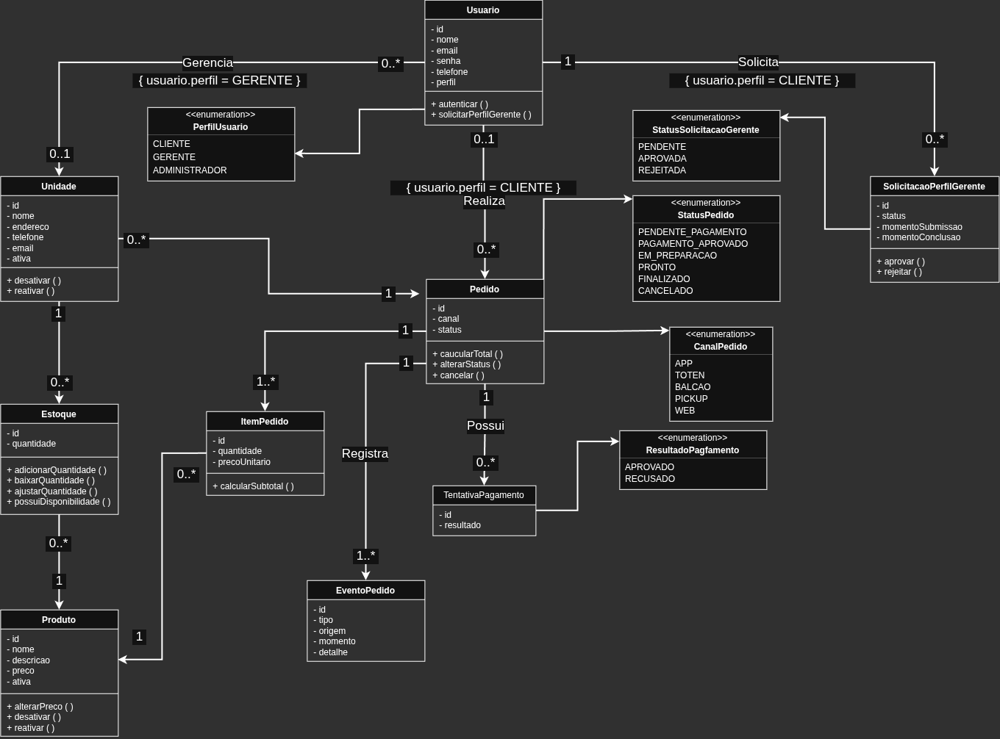

# Diagrama de Classes

Este documento apresenta as principais classes de domínio do Raízes Food
e seus relacionamentos.

O objetivo é representar de forma simplificada a estrutura utilizada
pela aplicação, mantendo coerência com o modelo conceitual e com os
requisitos definidos para o MVP.

## Diagrama

## Classes principais

- Usuario
- Unidade
- Produto
- Estoque
- Pedido
- ItemPedido
- TentativaPagamento
- EventoPedido
- SolicitacaoPerfilGerente

## Relacionamentos principais

- Um Pedido pertence a uma Unidade.
- Um Pedido possui um ou mais itens.
- Um Pedido pode possuir várias tentativas de pagamento.
- Um Pedido registra um ou mais eventos.
- Cada ItemPedido referencia um Produto.
- O Estoque relaciona Produto e Unidade.
- Um Pedido pode estar associado a um Cliente, sendo essa associação
  opcional nos canais operacionais.
- Um Gerente pode administrar várias Unidades.

## Observações

O diagrama representa apenas as classes principais do domínio.

Controllers, Services, Repositories e DTOs não fazem parte deste diagrama,
pois pertencem à estrutura técnica da aplicação e não ao domínio principal.