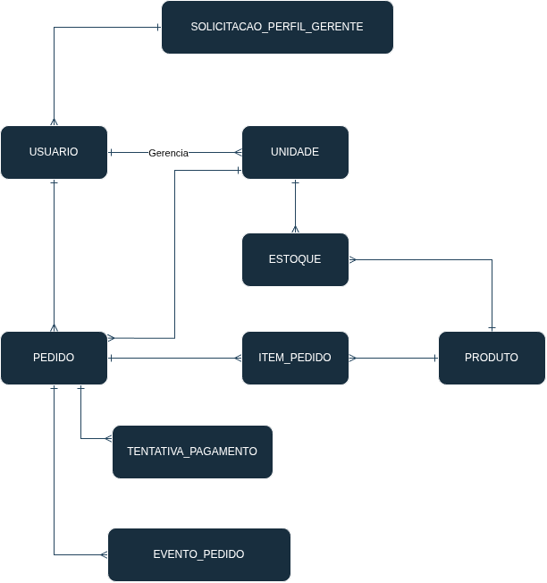

# Modelo Conceitual — Raízes Food

## 1. Objetivo

Apresentar as entidades, os relacionamentos e as regras conceituais essenciais do MVP Raízes Food, sem antecipar decisões de implementação ou de banco de dados.

## 2. Entidades

### Usuario

**Finalidade:**

Representar uma conta autenticável do sistema. Cliente, Gerente e Administrador são perfis de Usuario, não entidades distintas.

**Atributos principais:**

- identificador;
- nome;
- e-mail;
- senha protegida;
- perfil;
- telefone.

**Regras principais:**

- O e-mail deve ser único.
- Os perfis autenticáveis são `CLIENTE`, `GERENTE` e `ADMINISTRADOR`.
- Todo usuário comum inicia com perfil `CLIENTE`.
- Deve existir exatamente um Usuario com perfil `ADMINISTRADOR`.

### Unidade

**Finalidade:**

Representar uma unidade operacional da rede.

**Atributos principais:**

- identificador;
- nome;
- endereço;
- telefone;
- e-mail;
- ativa.

**Regras principais:**

- Uma Unidade pode possuir no máximo um Gerente responsável.
- A desativação é lógica e preserva o histórico.

### Produto

**Finalidade:**

Representar um produto do cardápio global da rede.

**Atributos principais:**

- identificador;
- nome;
- descrição;
- preço vigente;
- ativo.

**Regras principais:**

- O Produto e seu preço vigente são globais para toda a rede.
- A desativação é lógica e preserva o histórico.

### Estoque

**Finalidade:**

Representar a quantidade de um Produto em uma Unidade específica.

**Atributos principais:**

- identificador;
- quantidade disponível.

**Regras principais:**

- A quantidade não pode ser negativa.
- `ENTRADA` aumenta a quantidade.
- `BAIXA` diminui a quantidade após pagamento aprovado.
- `RETORNO` aumenta a quantidade após cancelamento quando já houve baixa.
- `AJUSTE` corrige ou redefine manualmente a quantidade.

### Pedido

**Finalidade:**

Representar uma solicitação de compra realizada para uma Unidade.

**Atributos principais:**

- identificador;
- canal;
- status.

**Regras principais:**

- Pertence a exatamente uma Unidade.
- Possui pelo menos um ItemPedido.
- Pode não possuir Cliente nos canais `BALCAO` e `TOTEM`.
- O total é derivado dos ItemPedido.

### ItemPedido

**Finalidade:**

Representar um Produto e sua quantidade em um Pedido.

**Atributos principais:**

- identificador;
- quantidade;
- preço unitário praticado.

**Regras principais:**

- O preço vigente do Produto é capturado na criação do Pedido e preservado historicamente.
- O subtotal é derivado da quantidade e do preço unitário praticado.

### TentativaPagamento

**Finalidade:**

Representar cada tentativa de pagamento de um Pedido.

**Atributos principais:**

- identificador;
- resultado.

**Regras principais:**

- O resultado é `APROVADO` ou `RECUSADO`.
- Uma tentativa aprovada representa o pagamento efetivado.
- Um Pedido pode possuir no máximo uma tentativa aprovada.

### EventoPedido

**Finalidade:**

Representar o histórico de eventos relevantes do ciclo de um Pedido.

**Atributos principais:**

- identificador;
- tipo de evento;
- origem operacional;
- momento;
- detalhe.

**Regras principais:**

- O histórico deve registrar criação, tentativa e resultado de pagamento, alteração de status e cancelamento.
- A origem operacional não exige identificação de funcionário em `BALCAO`, `TOTEM` ou `COZINHA`.

### SolicitacaoPerfilGerente

**Finalidade:**

Representar a solicitação de um Usuario Cliente para obter o perfil Gerente.

**Atributos principais:**

- identificador;
- status;
- momento da submissão;
- momento da conclusão.

**Regras principais:**

- Uma solicitação `PENDENTE` ou `REJEITADA` mantém o Usuario como `CLIENTE`.
- Somente uma solicitação `APROVADA` altera o perfil para `GERENTE`.
- Na aprovação, o Administrador define as Unidades do novo Gerente.

## 3. Relacionamentos e cardinalidades

### Usuario (Gerente) — Unidade

- Gerente: `1..N` Unidades.
- Unidade: `0..1` Gerente.

### Usuario (Cliente) — Pedido

- Cliente: `0..N` Pedidos.
- Pedido: `0..1` Cliente.

### Usuario — SolicitacaoPerfilGerente

- Cada SolicitacaoPerfilGerente pertence a exatamente `1` Usuario solicitante.
- O mínimo de solicitações por Usuario é `0`; a quantidade máxima permanece não definida.

### Unidade — Pedido

- Unidade: `0..N` Pedidos.
- Pedido: exatamente `1` Unidade.

### Unidade — Estoque

- Unidade possui registros de Estoque.
- Cada Estoque pertence a exatamente `1` Unidade.

### Produto — Estoque

- Produto pode estar relacionado a Estoques em várias Unidades.
- Cada Estoque referencia exatamente `1` Produto.

### Pedido — ItemPedido

- Pedido: `1..N` ItemPedido.
- ItemPedido: exatamente `1` Pedido.

### Produto — ItemPedido

- Produto: `0..N` ItemPedido.
- ItemPedido: exatamente `1` Produto.

### Pedido — TentativaPagamento

- Pedido: `0..N` TentativasPagamento.
- TentativaPagamento: exatamente `1` Pedido.

### Pedido — EventoPedido

- Pedido: `1..N` EventosPedido.
- EventoPedido: exatamente `1` Pedido.

## 4. Regras principais do modelo

- O e-mail de Usuario é único.
- Existe exatamente um Usuario com perfil `ADMINISTRADOR`.
- Todo usuário comum inicia com perfil `CLIENTE`.
- Solicitação aprovada altera o perfil de `CLIENTE` para `GERENTE`; solicitação pendente ou rejeitada mantém `CLIENTE`.
- Gerente administra uma ou várias Unidades, e Unidade possui no máximo um Gerente.
- Produto é global para toda a rede.
- Estoque é específico para uma combinação de Unidade e Produto, e sua quantidade não pode ser negativa.
- As operações `ENTRADA`, `BAIXA`, `RETORNO` e `AJUSTE` alteram diretamente a quantidade de Estoque conforme suas regras.
- Pedido pertence a exatamente uma Unidade e possui pelo menos um ItemPedido.
- Pedido pode não possuir Cliente em `BALCAO` e `TOTEM`.
- ItemPedido preserva o preço histórico do Produto.
- Pedido pode possuir várias TentativaPagamento, mas no máximo uma aprovada.
- Pedido mantém histórico por EventoPedido.
- Unidade e Produto utilizam desativação lógica.

## 5. Conceitos derivados

### Cardapio

Conjunto de Produtos ativos.

### Disponibilidade

Derivada da quantidade em Estoque da Unidade para o Produto.

### Pedido.total

Soma dos subtotais dos ItemPedido.

### ItemPedido.subtotal

Resultado de `quantidade × preço unitário praticado`.

## 6. Enumerações conceituais

### PerfilUsuario

- `CLIENTE`
- `GERENTE`
- `ADMINISTRADOR`

### CanalPedido

- `APP`
- `TOTEM`
- `BALCAO`
- `PICKUP`
- `WEB`

### StatusPedido

- `PENDENTE_PAGAMENTO`
- `PAGAMENTO_APROVADO`
- `EM_PREPARACAO`
- `PRONTO`
- `FINALIZADO`
- `CANCELADO`

### ResultadoPagamento

- `APROVADO`
- `RECUSADO`

### StatusSolicitacaoGerente

- `PENDENTE`
- `APROVADA`
- `REJEITADA`

`ENTRADA`, `BAIXA`, `RETORNO` e `AJUSTE` são operações de Estoque, não uma enumeração conceitual obrigatória neste modelo.

## 7. Diagrama conceitual

## 8. Observações

- Cardapio e Disponibilidade são conceitos derivados, não entidades.
- Atendente e Cozinha são atores operacionais e não são usuários autenticáveis.
- Pedido pode existir sem Cliente nos canais `BALCAO` e `TOTEM`.
- Decisões físicas serão tratadas posteriormente no DER e no modelo lógico.
