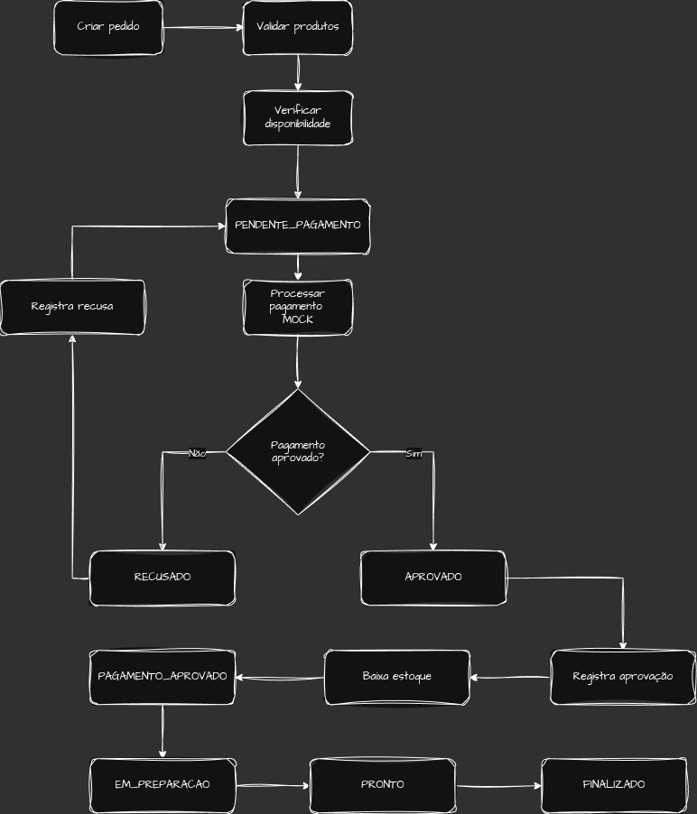

# Fluxo Crítico do Pedido

Este documento apresenta o principal fluxo de negócio do Raízes Food,
desde a criação de um pedido até sua finalização.

O fluxo foi escolhido por envolver as principais operações do sistema:
pedido, disponibilidade de produtos, pagamento, estoque e atualização
de status.

## Fluxo principal

O processo começa com a criação do pedido e a validação dos produtos
selecionados. Antes de prosseguir com o pagamento, o sistema verifica
se os produtos possuem disponibilidade suficiente na unidade escolhida.

Com os itens disponíveis, o pedido é criado com o status
`PENDENTE_PAGAMENTO` e pode seguir para o processamento do pagamento
utilizando o Gateway de Pagamento Mock.

Caso o pagamento seja recusado, a tentativa é registrada e o pedido
permanece como `PENDENTE_PAGAMENTO`, permitindo uma nova tentativa.

Quando o pagamento é aprovado, o resultado é registrado e os itens do
pedido são baixados do estoque da unidade. Em seguida, o pedido assume
o status `PAGAMENTO_APROVADO`.

Após a confirmação do pagamento, o pedido segue seu ciclo normal de
preparação:

`PAGAMENTO_APROVADO` → `EM_PREPARACAO` → `PRONTO` → `FINALIZADO`

## Diagrama

O diagrama abaixo representa o fluxo crítico descrito anteriormente.

## Regras importantes

Durante esse fluxo, algumas regras de negócio devem ser respeitadas:

- a disponibilidade dos produtos é verificada antes do pagamento;
- a baixa do estoque ocorre somente após a aprovação do pagamento;
- uma tentativa recusada não altera o estoque;
- após uma recusa, o pedido permanece pendente e pode receber uma nova
  tentativa de pagamento;
- o preço utilizado no pedido deve ser preservado no item do pedido;
- as alterações de status devem respeitar a sequência definida para o
  ciclo do pedido.

## Escopo do diagrama

O diagrama representa somente o fluxo crítico principal do pedido.

Fluxos complementares, como cancelamento e retorno de produtos ao estoque,
não foram detalhados neste diagrama para manter a representação objetiva.
Esses comportamentos permanecem definidos nas regras de negócio do sistema.